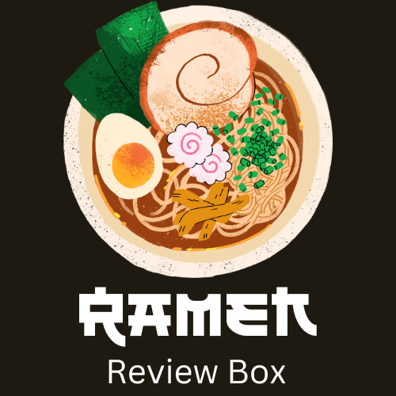

# <ラーメンレビューボックス>

## サイト概要
### サイトテーマ
自分の食べたラーメンを投稿し、他の人に紹介するレビューサイト

### テーマを選んだ理由
既に存在するレビューサイトは全部の食に対してのレビューサイトが多く、ラーメンだけのレビューサイトは少ないです。
ラーメンだけを知りたい人がすぐにラーメンに出会える、ラーメンだけのレビューサイトがあれば便利だと思いこのテーマにしました。

### ターゲットユーザ
- 自分の食べたラーメンを共有したい人
- ラーメンが食べたい人
- 自分の知らないラーメンを知りたい人

### 主な利用シーン
- 自分の食べたラーメンをレビューする時
- 自分の知らないラーメンを検索する時
- 自分がレビューしたものにいいね・コメントがついているか確認する時

## 設計書
- ER図 https://app.diagrams.net/#G1uhlLUIjEYXvaaBZwotQQlqgSh0TIGnhZ
- テーブル定義書 https://docs.google.com/spreadsheets/d/1_qu_w3o0V74vTAcNwyXtpcRDNR3S-AtI/edit#gid=1243549839
- アプリケーション詳細設計 https://docs.google.com/spreadsheets/d/1NfUbSrBc9Ml23t4SGh8vJt1l3WoD-QusDi_y-EAuM-g/edit#gid=549108681

## 開発環境
- OS：Linux(CentOS)
- 言語：HTML,CSS,JavaScript,Ruby,SQL
- フレームワーク：Ruby on Rails
- JSライブラリ：jQuery
- IDE：Cloud9

## 使用素材
使用検討中です